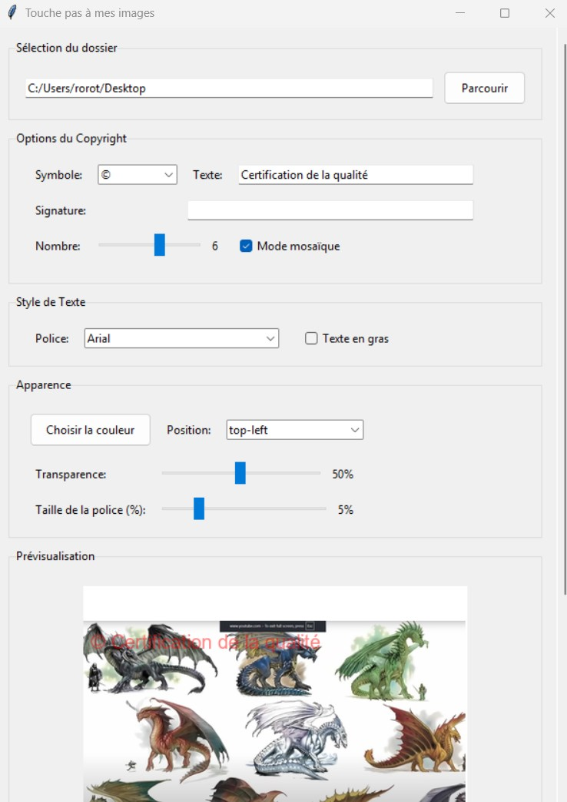

# 🖼️ CestMonImage - Application de Copyright d'Images

Application Windows permettant d'ajouter facilement un ou plusieurs filigranes (copyright) sur des images, avec personnalisation avancée et traitement par lot.

## 📸 Aperçu



## ✨ Fonctionnalités principales

### 📁 Sélection des sources
- **Mode Dossier** : Traitement par lot de toutes les images d'un dossier
- **Mode Image** : Sélection d'une image unique à traiter
- **Nom de sortie personnalisable** : `monimage` → `monimage_001.jpg`, `monimage_002.jpg`...
- **Gestion des doublons** : Ajout automatique d'un suffixe si le fichier existe

### 🎨 Style du watermark
- **Symbole** : ©, ®, ™, (c), All Rights Reserved
- **Texte personnalisé** : Votre texte de copyright
- **Police** : Arial, Verdana, Calibri, Georgia, Juice ITC, etc.
- **Texte en gras** : Support natif ou simulation pour polices sans Bold
- **Couleur** : Palette complète avec sélecteur de couleur
- **Transparence** : 0% à 100%
- **Taille** : 1% à 20% de la largeur de l'image

### 📍 Positionnement
- **Haut-Gauche** / **Haut-Droite**
- **Bas-Gauche** / **Bas-Droite**
- **Centre**
- **Mode Mosaïque** : Watermarks répétés sur toute l'image avec rotation -15°

### 🔧 Options Mosaïque
- **Espacement horizontal** : 0.1x à 5.0x
- **Espacement vertical** : 0.1x à 5.0x
- **Nombre de watermarks** : Calculé automatiquement

### 📝 Métadonnées EXIF (JPEG)
- **Auteur** : Enregistré dans les propriétés de l'image
- **Titre** : Titre de l'image
- **Objet** : Sujet/thème de l'image
- **Commentaires** : Commentaires libres
- **Copyright** : Texte complet du copyright
- **Date** : Date d'application du watermark
- **Logiciel** : "CestMonImage"

### 👁️ Prévisualisation en temps réel
- Mise à jour automatique à chaque modification de paramètre
- Aperçu fidèle du rendu final

## 📋 Formats supportés

| Format | Lecture | Écriture | Métadonnées EXIF |
|--------|---------|----------|------------------|
| JPEG   | ✅      | ✅       | ✅               |
| PNG    | ✅      | ✅ (→JPEG) | ❌             |
| BMP    | ✅      | ✅ (→JPEG) | ❌             |
| GIF    | ✅      | ✅ (→JPEG) | ❌             |

## 🚀 Installation

### Prérequis
- Windows 10/11
- Python 3.11+ recommandé

### Installation (développement)

1. **Créez un environnement virtuel**

```bash
python -m venv .venv
.venv\Scripts\activate
```

2. **Installez les dépendances**

```bash
pip install -r requirements.txt
```

3. **Lancez l'application**

```bash
python watermark_app.py
```

## 📦 Build de l'exécutable Windows

### Option 1 : Commande rapide

```bash
pyinstaller --name=CestMonImage --onefile --noconsole --clean --distpath=exe_final --add-data=fonts;fonts watermark_app.py
```

### Option 2 : Script dédié

```bash
python build_exe.py
```

L'exécutable sera généré dans `exe_final/`.

## 🎯 Guide d'utilisation

1. **Sélectionnez la source**
   - Choisissez "Dossier" ou "Image" 
   - Cliquez sur "Parcourir"

2. **Configurez le watermark**
   - Symbole et texte du copyright
   - Police, gras, couleur, taille

3. **Choisissez la position**
   - Position fixe (coins, centre)
   - Ou mode mosaïque pour couvrir l'image

4. **Remplissez les métadonnées** (optionnel)
   - Auteur, Titre, Objet, Commentaires

5. **Vérifiez la prévisualisation**

6. **Cliquez sur "Appliquer le copyright"**

Les images sont sauvegardées avec le nom défini : `nom_001.jpg`, `nom_002.jpg`...

## 🔧 Détails techniques

| Composant | Technologie |
|-----------|-------------|
| Interface | Tkinter / ttk |
| Traitement d'image | Pillow (PIL) |
| Métadonnées EXIF | piexif |
| Packaging | PyInstaller |
| Windows Shell | pywin32, winshell |
| Processus | psutil |

## ⚠️ Dépannage

| Problème | Solution |
|----------|----------|
| Exécutable ne se génère pas | Vérifiez que `fonts/arial.ttf` est présent |
| Erreur EXIF | Le fichier sera converti en JPEG sans métadonnées |
| Erreur de permission | Exécutez le terminal en administrateur |
| Police non trouvée | Fallback automatique sur Arial |

## 📄 Licence

Ce projet est fourni tel quel. Ajoutez votre licence si besoin (MIT, Apache-2.0, etc.).

## 📝 Notes

- Les images originales ne sont **jamais** modifiées
- Les résultats sont écrits avec le nom de sortie configuré
- L'auteur n'est **pas** affiché sur l'image (métadonnées uniquement)
